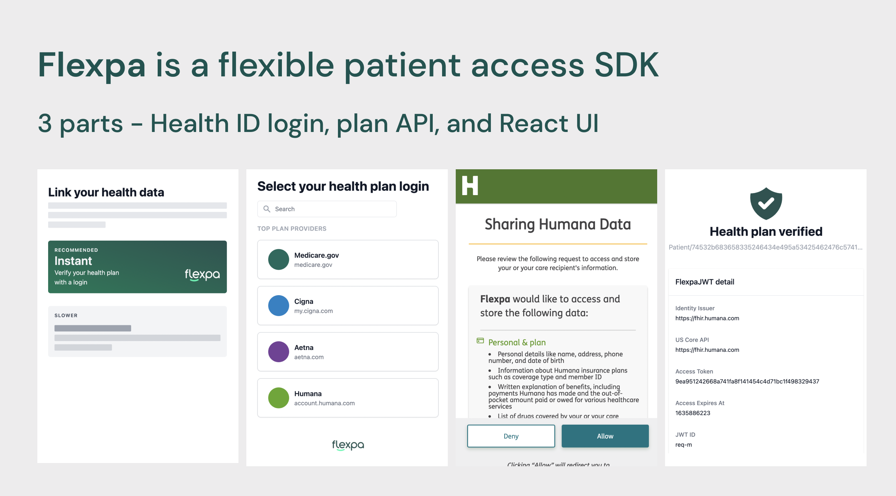

# 🤔 What is Flexpa?

## Flexpa is a flexible patient access SDK.

### We help devs build products that are patient-centric.

As of July 1, \~80M US patients can sign-in with a modern accounts/identity mechanisms (OAuth 2.0) from major health insurance plan administrators. These are new kinds of Health IDs.

With Health IDs, patients can grant apps permission to access a graph (API) of structured healthcare data such as medications, procedures, observations, care plans, coverage, and more.

There are dozens of Health IDs in production and we’re a flexible way for patients to connect to them all.


