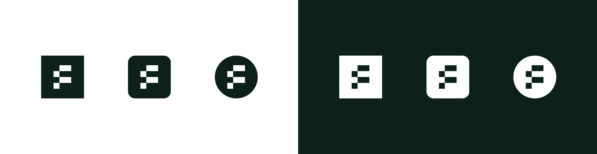
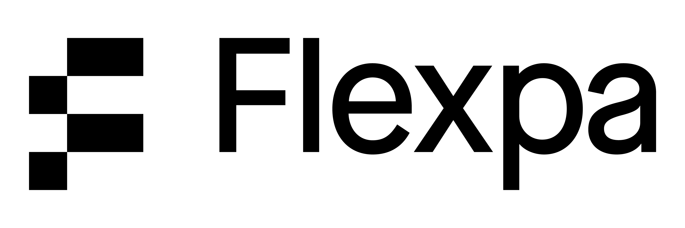
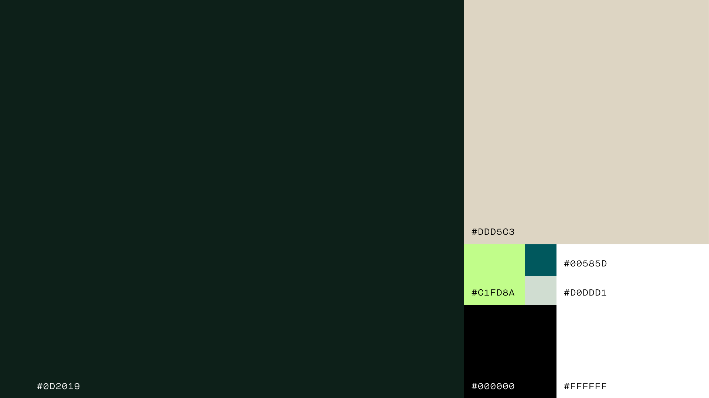
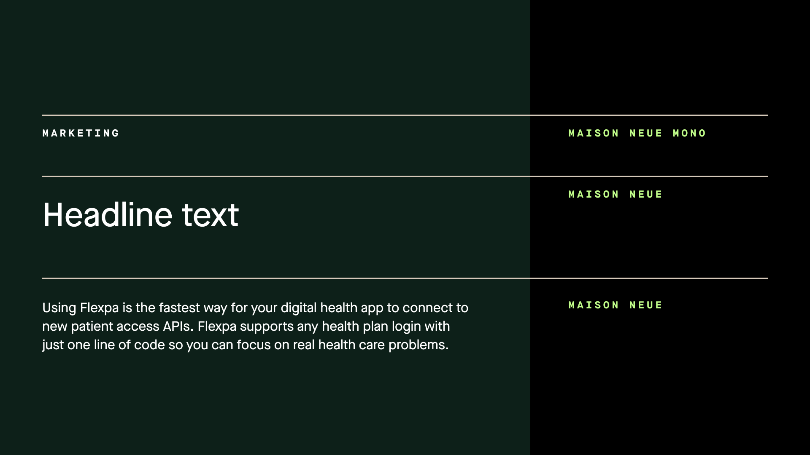
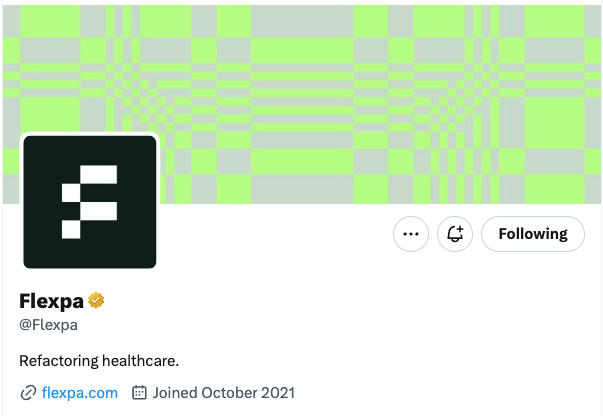
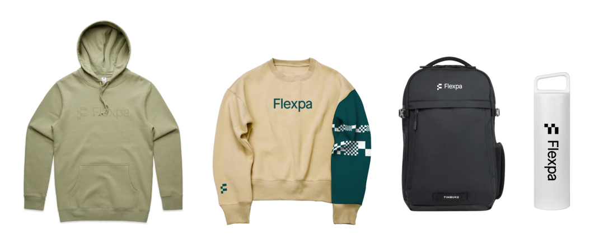

# 🎨 Our Brand
This is a living document meant to capture our evolving brand. 

## Brand philosophy
Flexpa’s name originates from our belief in **Fl**exible **P**atient **A**ccess, and our brand captures the essence of each of those key words. 

* **Flexible**: We remain driven to provide the best developer experience for applications across the industry. The use cases are many, and as reflected in our logo, we strive to be the building blocks to serve them.
* **Patient**: One of our core values is to be empathy experts. Though our users are developers, we remain focused on the end patient’s experience to drive our decisions. 
* **Access**: We believe everyone should have unhindered access to a full record of their own health history. Our commitment to transparency extends beyond the product of our work. It’s reflected in our approach to pricing, descriptions of what we do and don’t do, and in our internal Flexpal culture. 

---

## Logo & pattern blocks
From launch we’ve garnered attention with our unconventional visual style. From our logo and patterns, we hope to show that we’re bold, but structured. We’re energetic, but serious.  We’re unconventional but compliant. 

## Brand colors
Our color palette embraces a range of green tones. Both traditional teals found in the healthcare space juxtaposed with a striking lime color as our differentiator. 

## Typography
We use two fonts: Maison Neue Mono and Maison Neue. The first is a nod to programming used very selectively in marketing contexts. The second is a hard working sans serif used as our primary font. 

## Illustrations
Stay tuned! As our company grows and our brand develops, our next large scale addition will be illustrators to add visual context in our marketing and product. 

## Our brand in action
**Loading states**

**Social banners**

**Swag**

## Other brand documents we admire

* Plaid's "Refreshing Plaid's brand" [article](https://plaid.com/blog/refreshing-plaids-brand/)
* Oscar's "How we redesigned the Oscar brand to speak to our growing member base" [article](https://oscardesign.team/How-we-redesigned-the-Oscar-brand-to-speak-to-our-growing-member-base)
* Warp's "How We Work" [living document](https://warpdev.notion.site/Public-Warp-How-We-Work-b872d41a1da743fca18220a731aeba48)