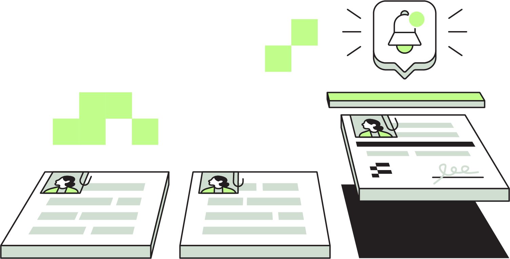

# 🎨 Our Brand
This is a living document meant to capture our evolving brand. 

## Brand philosophy
Flexpa’s name originates from our belief in **Fl**exible **P**atient **A**ccess, and our brand captures the essence of each of those key words. 

* **Flexible**: We remain driven to provide the best developer experience for applications across the industry. The use cases are many, and as reflected in our logo, we strive to be the building blocks to serve them.
* **Patient**: One of our core values is to be empathy experts. Though our users are developers, we remain focused on the end patient’s experience to drive our decisions. 
* **Access**: We believe everyone should have unhindered access to a full record of their own health history. Our commitment to transparency extends beyond the product of our work. It’s reflected in our approach to pricing, descriptions of what we do and don’t do, and in our internal Flexpal culture. 

---

## Logo & pattern blocks
From launch we’ve garnered attention with our unconventional visual style. From our logo and patterns, we hope to show that we’re bold, but structured. We’re energetic, but serious.  We’re unconventional but compliant. 

## Brand colors
Our color palette embraces a range of green tones. Both traditional teals found in the healthcare space juxtaposed with a striking lime color as our differentiator. 

## Typography
We use two fonts: Maison Neue Mono and Maison Neue. The first is a nod to programming used very selectively in marketing contexts. The second is a hard working sans serif used as our primary font. 

## Illustrations

An API product is inherently hard to “visualize”. That is ultimately why we built an entire demo application called MyFlexpa. However, being able to communicate concepts visually not only provides a much needed breather in dense content, but it can also improve engagement and retention of that content. That’s why we have begun to build out our illustration set at Flexpa.

We use illustrations primarily in sales and go to market (decks, websites, sales collateral), where visuals help us condense complex topics into digestible visuals. 

We use illustrations sparingly in our tooling (Link, Portal, internal apps) to allow the user to focus on the job to be done. You may see them in empty states, error states, or landing pages. 

Our illustrations carry forward our brand in several ways:

1. **Hard edges:** Flexpa has a strong, confident stance, and the hard lines and minimally rounded corners throughout our brand and typography are continued through the illustrations. 

  

2. **Narrow color palette:** the minimal necessary to be additive to comprehension and call out appropriate features.

  

3. **Flat shadowing:** While it’s difficult to stay completely in 2D, we kept our illustrations to a head-on perspective wherever we could. Sometimes depth is needed to get the concept across most accurately, and in those cases we use flattened shadows. 

  

4. **Building blocks:** Our logo is created from 6 square pixels because Flexpa’s strives to be the building blocks of health data. We bring these pixels along for the ride across all of our illustrations as a motif. 

  

We are continuing to add to the illustration set with larger illustrations depicting more complex scenes and contexts. 

## Flexpa naming conventions
While not a visual element, naming conventions and a consistent voice are important parts of a person’s perception of brand. Flexpa’s tools have descriptive names, so to both retain our branding and ensure clarity, we append the word “Flexpa” at the beginning of each tool’s name. For example, Flexpa API, Flexpa Link, and Flexpa Portal. 

---

## Our brand in action
**Loading states**

**Social banners**

**Swag**

---

## Other brand documents we admire

* Plaid's "Refreshing Plaid's brand" [article](https://plaid.com/blog/refreshing-plaids-brand/)
* Oscar's "How we redesigned the Oscar brand to speak to our growing member base" [article](https://oscardesign.team/How-we-redesigned-the-Oscar-brand-to-speak-to-our-growing-member-base)
* Warp's "How We Work" [living document](https://warpdev.notion.site/Public-Warp-How-We-Work-b872d41a1da743fca18220a731aeba48)
